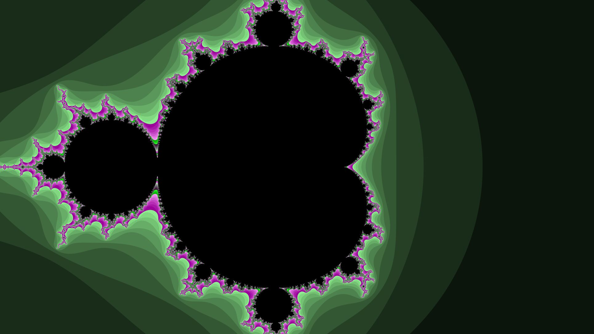
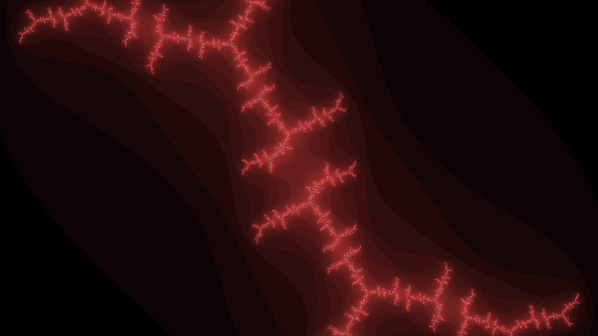
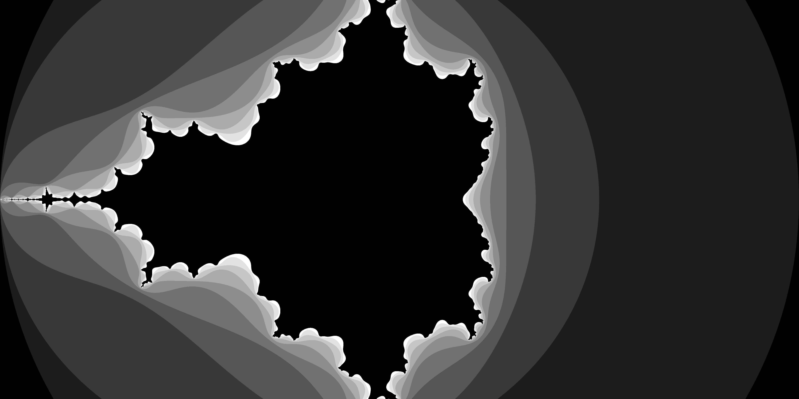

# Mandelbrot and Julia fractal image generator




## Description
Fractals is a console application to create [fractal](https://en.wikipedia.org/wiki/Fractal) images.
It uses the .bmp format as output.
Compiles every time the program has to output an image.
Supports both [Mandelbrot](https://en.wikipedia.org/wiki/Mandelbrot_set) and [Julia](https://en.wikipedia.org/wiki/Julia_set) sets.

## Install
### Dependencies
There is no dependency.
BMP format can only be read on Windows, or either on [VsCode](https://code.visualstudio.com/) or [Atom editor](https://atom.io/) with macOS / linux.
### CMake installation
Make sure you have CMake installed and inside the clone repo, type:
```
mkdir build
cd build
cmake ..
cmake --build .
```
or use CMake GUI and create your project with your favourite IDE.

## Usage
### Settings
Settings of the fractal [main.cpp](mains/main.cpp):
- give a path to the file (if not absolute path, then the root is inside build/project_configuration)
- true if the fractal should be a Julia set, false if it should be a Mandelbrot set
- enter the complex number c of the fractal, enter anything if Mandelbrot, enter the chosen c for Julia
- choose an offset in x or y to have a non centered image
- choose an output ratio for the image (16/9, 19/10, 4/3, etc...)
- choose a resolution factor (such as 1000 pixels)
- choose a zoom coefficient (x2 zooms in, x.5 zooms out)
- decide of the number of iterations to allow before stopping the sequence
- (optional: specifiy the symmetry of the mandelbrot or julia fractal)

Recommended [settings](mains/main.cpp) are for instance:
```
fractal("G:/test.bmp", true, std::complex<double>(.63, .87), 0 ,0, 16./9., 1000, 1, 35);
```
The number of iterations controlls the detail of the fractal, see [assets/iteration_effect](assets/iteration_effect). It has an exponential cost on RAM and CPU usage and require mutliple gagabytes of memory to run a high resolution file with iterations per complex number. In addition the output file can also reach multiple gigabytes.

## Known bugs
- ...

## Improvements
Future versions will add:
- [ ] Add a smoothing option for the contour of the fractal
- [ ] Add a color options such as black and white, RGB and define color palets
- [ ] Parallelisation / concurrency to get faster computation speeds
- [ ] Optimize vectors by allocating them directly their definitive size
- [ ] Image compression
- [ ] Other, more common output formats
- [ ] Maybe a GUI, using ImGui ?

## Performances
- Bencharking is available in the main.cpp file
