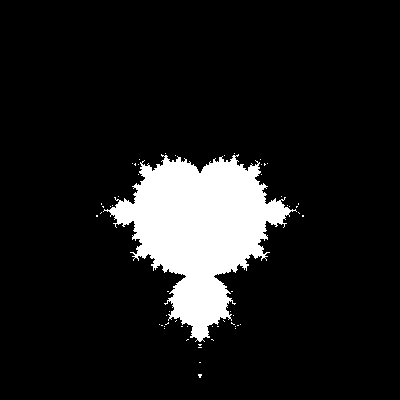

# fractals

## Description
Fractals is a console application to create [fractal](https://en.wikipedia.org/wiki/Fractal) images.
It uses the .bmp format as output.
For the moment, only supports the [Mandelbrot](https://en.wikipedia.org/wiki/Mandelbrot_set) set.

## Dependencies
There are no dependencies for the moment.

## Install
Make sure you have CMake installed and inside the clone repo, type:
```
mkdir build
cd build
cmake ..
cmake --build .
```

## Usage
Run the main executable and trick some values.

## Known bugs
- Crash by modifying the size of the fractal window

## Improvements
Future versions will add:
- [ ] Support for [Julia](https://en.wikipedia.org/wiki/Julia_set) set
- [ ] Better user console interface
- [ ] Parallelisation to get faster computation speeds
- [ ] Image compression
- [ ] Other, more common output formats
- [ ] Maybe a GUI, using ImGui ?

## Performances
-
