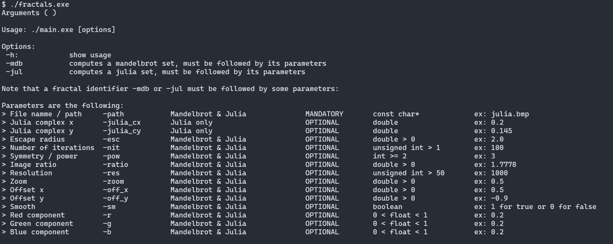

# Mandelbrot and Julia fractal image generator


## Description
Fractals is a console application to create [fractal](https://en.wikipedia.org/wiki/Fractal) images.
It uses the .png format as output.
Supports both [Mandelbrot](https://en.wikipedia.org/wiki/Mandelbrot_set) and [Julia](https://en.wikipedia.org/wiki/Julia_set) sets.

## Install
### Pre-compiled executable
If you do not want to compile windows binaries, you can use the [release executable](fractals.exe).

### Dependencies
There is no dependency.
BMP format can only be read on Windows, or either on [VsCode](https://code.visualstudio.com/) or [Atom editor](https://atom.io/) with macOS / linux.
This format has also the inconvenient to produce very heavy files on the disk (to enhance).

### CMake installation
Make sure you have CMake installed and inside the clone repo, type:
```
mkdir build
cd build
cmake ..
cmake --build .
```
or use CMake GUI and create your project with your favourite IDE.
or use the build-in scripts present in the [scripts folder](scripts).

## Usage
Simply launch the executable from the command line and some help will appear to guide you through the steps of creating julia or mandelbrot fractals.



### Settings
The number of iterations controlls the detail of the fractal, see [assets/iteration_effect](assets/iteration_effect). It has an exponential cost on RAM and CPU usage and require mutliple gagabytes of memory to run a high resolution file with iterations per complex number. In addition the output file can also reach multiple gigabytes.

## Known bugs
- ...

## Improvements
Future versions will add:
- [ ] Add a smoothing option for the contour of the fractal
- [ ] Add a color options such as black and white, RGB and define color palets
- [ ] Parallelisation / concurrency to get faster computation speeds
- [ ] Optimize vectors by allocating them directly their definitive size
- [ ] Image compression
- [ ] Other, more common output formats
- [ ] Maybe a GUI, using ImGui ?

## Performances
- Bencharking is available in the main.cpp file
