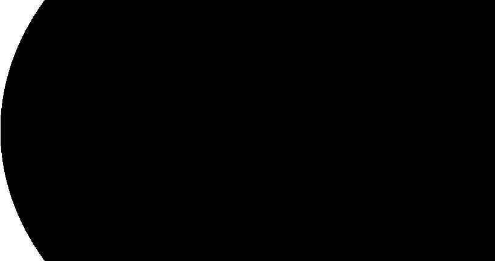
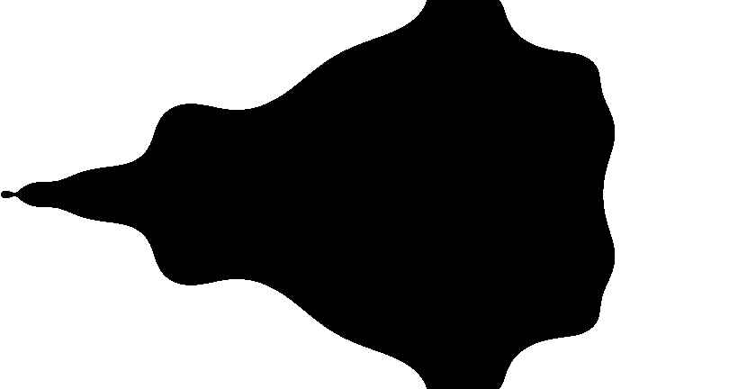
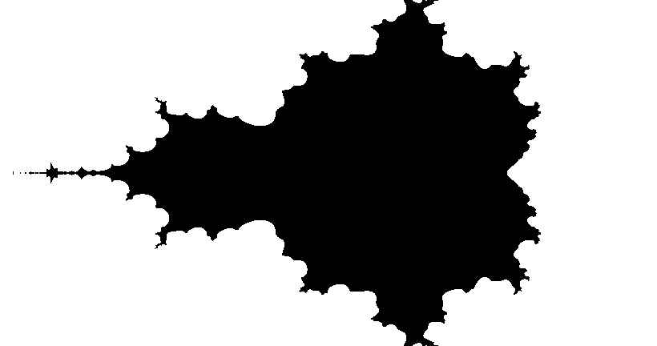
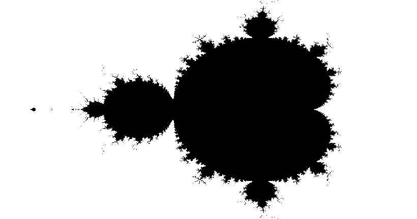

# fractals


## Description
Fractals is a console application to create [fractal](https://en.wikipedia.org/wiki/Fractal) images.
It uses the .bmp format as output.
For the moment, only supports the [Mandelbrot](https://en.wikipedia.org/wiki/Mandelbrot_set) set.

## Install
### Dependencies
There is no dependency.
### CMake installation
Make sure you have CMake installed and inside the clone repo, type:
```
mkdir build
cd build
cmake ..
cmake --build .
```
or use CMake GUI and create your project with your favourite IDE.

## Usage
### Settings
Settings of the fractal [main.cpp](mains/main.cpp):
- give a path to the file (if not absolute path, then the root is inside build/project_configuration)
- choose an offset in x or y to have a non centered image
- choose an output ratio for the image (16/9, 19/10, 4/3, etc...)
- choose a resolution factor (such as 1000 pixels)
- choose a zoom coefficient (x2 zooms in, x.5 zooms out)
- decide of the number of iterations to allow before stopping the sequence
Recommended [settings](mains/main.cpp) are for instance:
```
fractal("G:/test.bmp",0 ,0, 16./9., 1000, 1, 35);
```
The number of iterations controlls the detail of the fractal, see [assets/iteration_effect](assets/iteration_effect). It has an exponential cost on RAM and CPU usage and require mutliple gagabytes of memory to run a high resolution file with iterations per complex number. In addition the output file can also reach multiple gigabytes.

## Known bugs
- Do not work if some unvalid negative settings are chosen (lack of asserts in the fractal function)

## Improvements
Future versions will add:
- [ ] Support for [Julia](https://en.wikipedia.org/wiki/Julia_set) set
- [ ] User console interface
- [ ] Parallelisation / concurrency to get faster computation speeds
- [ ] Image compression
- [ ] Other, more common output formats
- [ ] Maybe a GUI, using ImGui ?

## Performances
-

# Iteration effect : demo
## 1 iteration per complex number

## 5 iterations per complex number

## 10 iterations per complex number

## 20 iterations per complex number

## 30 iterations per complex number

## 40 iterations per complex number

## 50 iterations per complex number

## 60 iterations per complex number

## 70 iterations per complex number

## 80 iterations per complex number

## 90 iterations per complex number

## 100 iterations per complex number

## 110 iterations per complex number

